# 스리라까(Threelaka) - TED  영상 활용 영어 공부 플랫폼

📆 **프로젝트 진행기간 : 2022/10/10 ~ 2022/11/21**

🤠 **FE: 김누리(팀장), 김동욱, 김지현**

😼 **BE: 김혜라, 이재준, 최지원**

📽 **UCC 및 프로젝트 설명 링크**


## 👭 소개

###  Ted 영상으로 영어 `스`피킹, `리`딩, 리스닝, `라`이팅`까`지 <스리라까>

```plaintext
영어를 몇년을 배워도, 외국인과 프리토킹 한 번 못해봤다면? 열심히 토익 학원을 다녀도 내 영어실력이 늘고 있는지 의심되었다면? 스리라까를 만나보세요. 
스리라까는 Speaking Reading Listening Writing 까지 한번에 학습할 수 있게 해주는 교육 플랫폼입니다. 먼저, 협업 필터링 알고리즘을 이용하여 사용자에게 맞춤 TED 영상을 추천합니다. 그 다음에는 해당 영상을 듣고(Listening) 스크립트를 읽으며(Reading) 모르는 단어를 저장합니다. 다음 단계는 Writing 입니다. 앞서 저장한 단어를 바탕으로 Essay를 쓰며 학습한 내용을 점검합니다. 오탈자를 교정해주는 기능을 이용해 정확도를 높여보세요! 
다음으로는 에세이를 이용해서 Speaking 연습을 할 수 있습니다. 연습하는 모습을 녹화하고 저장할 수 있고 음을 연습할 수 있어요. 추가로, 길드 기능을 이용해 스터디를 꾸리고 길드원들과 함께 학습할 수 있습니다. 
```


## 🔬주요 기능 


- 협업 필터링 알고리즘을 이용하여 사용자에게 맞춤 TED 영상을 추천
- 학습 스타일 별 커스텀  UI  제공
- 테드 영상 스크립트와 영상을 동기화하여 제공하여 리딩 학습
- 저장된 단어장으로 에세이 작성시 사용 단어 체크
- 문법 검사 및 발음 검사
- 대시보드를 활용한 사용자 스터디 기록 시각화
- 길드 기능을 활용한 스터디 그룹 생성으로 공부 동기 부여


## 🔎  스리라까 서비스 화면

#### 1. 시작 페이지


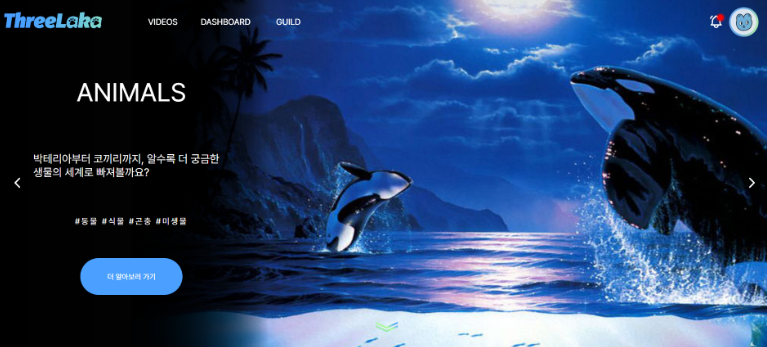

- 인간, 생물, 자연, 지식, 산업, 기술, 문화예술 7가지 태그를 바탕으로 사용자의 선호도를 파악합니다. 
- 각 태그의 바로가기 버튼을 통해 관련한 TED 영상을 조회할 수 있습니다. 


#### 2. VIDEOS 페이지 

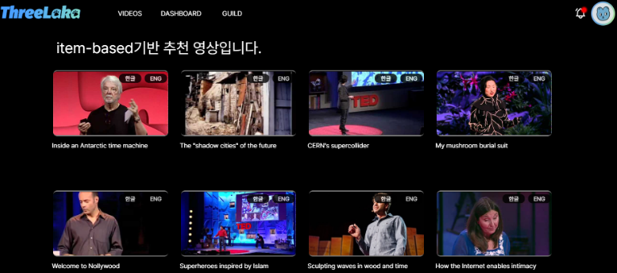


- 아이템 기반 협업 필터링을 활용한 페이지입니다. 사용자의 선호도를 바탕으로 맞춤 영상을 추천합니다.
- 키워드별 영상 검색을 통해 다양한 학습 영상을 찾을 수 있습니다. 


#### 3. DASHBOARD 페이지 

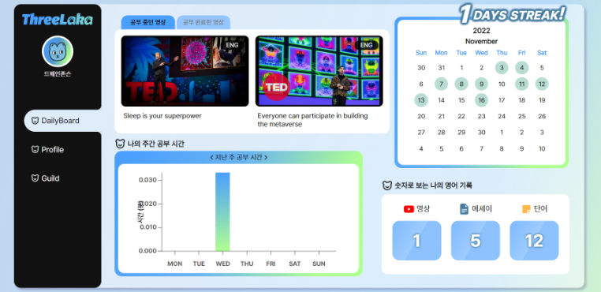

- 자신의 학습 시간, 학습 기록을 확인할 수 있습니다. 
- 최근에 학습했던 영상의 정보, 월별 학습량, 주별 학습량, 그리고 누적 학습량을 통해 공부 현황을 파악합니다. 


#### 4. GUILD 페이지 

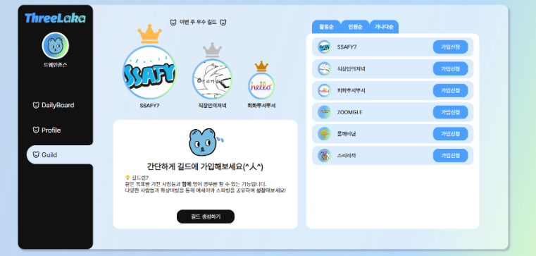


- 다른 사람과 함께 학습할 수 있는 공간입니다. 한 개의 길드에 가입할 수 있으며, 길드 마스터가 승인하면 가입됩니다. 
- 가입 전 우수길드를 확인하거나 인원순 등으로 정렬하여 이용자에게 길드 정보를 알려줍니다. 


#### 5. Reading & Listening 페이지 

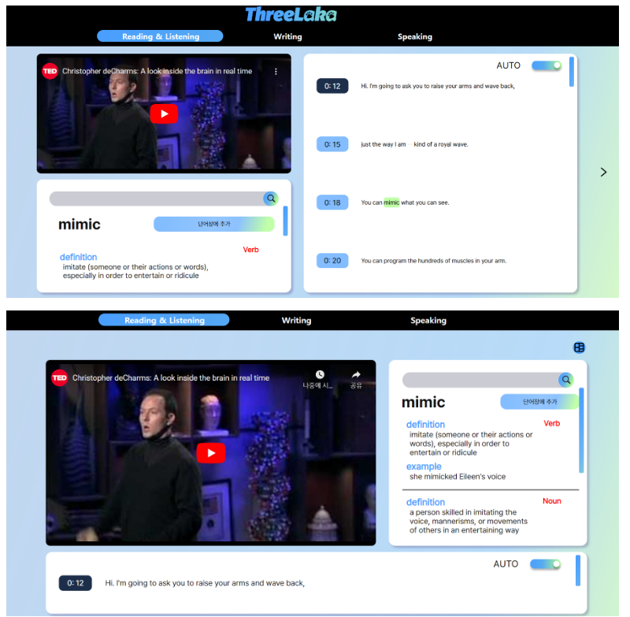


- TED 영상을 실행하여 Listening 을 학습합니다. 스크립트에 맞춰 자동 스크롤 또는 수동 스크롤 기능을 제공합니다. 
- 모르는 단어는 단어장에 추가 버튼을 활용하여 저장합니다. 레이아웃 변경 버튼을 이용해 화면 구성을 조정할 수 있습니다. 


#### 6. Writing 페이지 

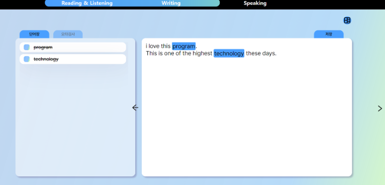

- 앞서 저장한 단어를 활용하여 직접 Essay를 작성합니다. 
- Essay에 활용한 단어에는 가로 줄이 생성되어 UX를 향상시켰습니다. 
- 오타 검사 기능을 통해 정확한 작문을 돕습니다.
- 저장 버튼을 통해 학습 기록에 essay를 저장할 수 있습니다. 


#### 7. Speaking 페이지

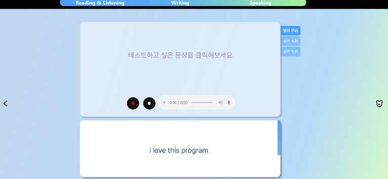 

- 내 essay를 가지고 speaking 연습을 해볼 수 있습니다. 녹화와 녹음 기능을 제공합니다

- 발음 검사를 통해 더 정확한 발음으로 연습할 수 있도록 돕습니다. 


## 🧰개발 환경

#### OS: Windows 10

 #### IDE

-  IntelliJ 2021.3.2
- Visual Studio Code 1.70.1
- UI/UX: Figma

#### Database

- MySQL 8.0.30

- Redis 7.0.4

- Server: AWS EC2 Ubuntu 20.04 LTS


#### Dev-Ops

- Docker 20.10.18
- Jenkins 2.60.3
- Nginx - 1.18.0

  

### ⌨ Backend 

- Spring boot 2.7.3

- Fast API latest ver.

- Python 3.9.2 

- Open JDK 8

- Gradle 7.5

- Querydsl 5.0

  


### 🖥 Frontend

- HTML5, CSS3, JavaScript(ES6)
- React 17.0.2
- TypeScript  4.8
- redux 4.2.0
- Redux-Saga 1.2.1  
- redux-toolkit 1.8.3
- Node.js 16.14.0 
- styled-components 5.3.5
- yarn 1.22.19
- VSCode Extension

  - Prettier - Code formatter (Ver 9.5)
  - ES Lint (Ver 2.2.6)
  - Reactjs code snippets (Ver 2.4.0)


## 🧩서비스 아키텍처

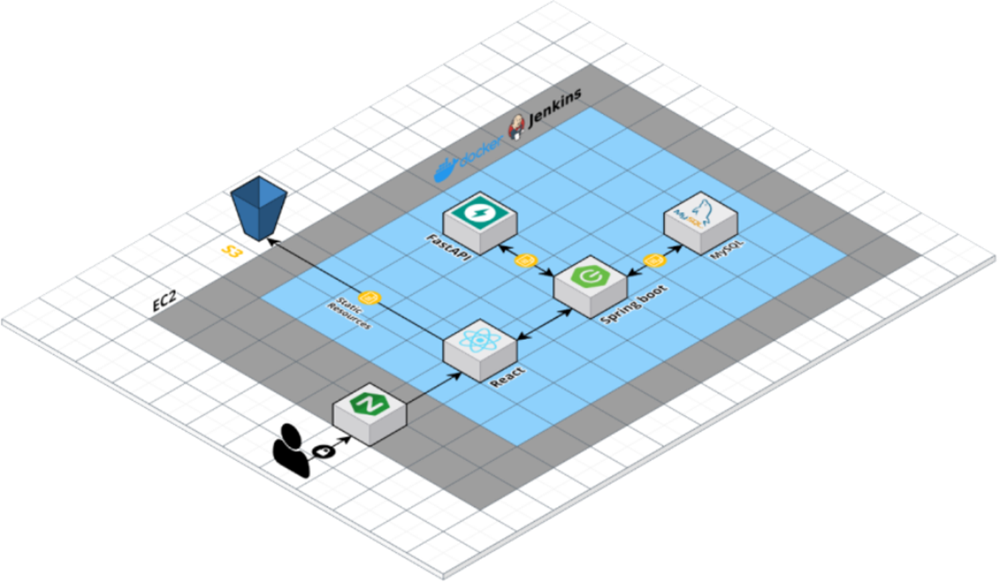


## 🌈기술 특이점

- 추천 알고리즘

- 커스텀  UI

- 대시보드

- 단어테스트

- 베타테스트 진행

  - 개발용 서버와 사용자용 서버 분리

- 문법 검사 및 발음 연습

- 공통 디자인 모듈화

  

  

## 🤝🏻협업 툴

- Gitlab

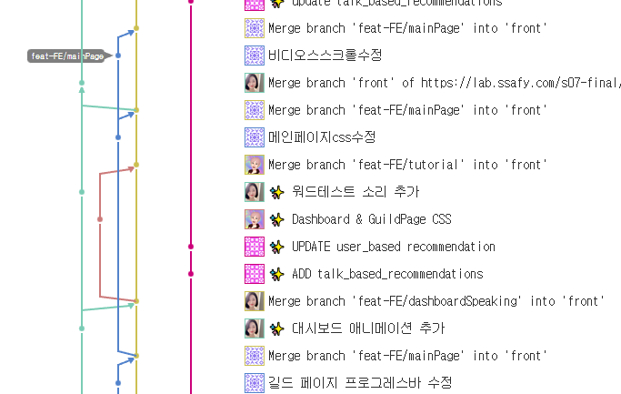


- Jira

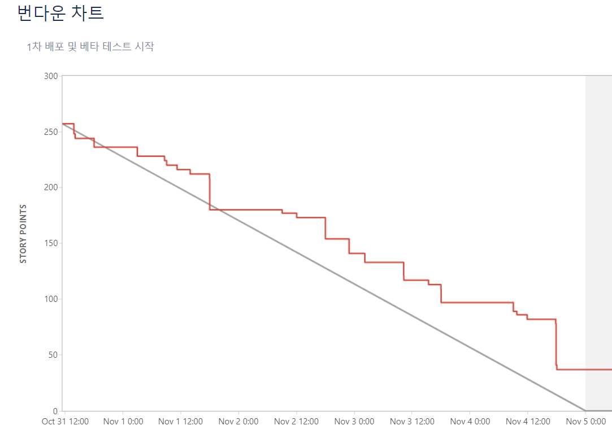


- Notion
  - 공유: 개발을 하며 참고할 수 있는 레퍼런스, 사이트 링크 등을 모아 팀원들과 공유
    - 협업: 협업개발에 필요한 컨벤션, 프로젝트 일정 등 정리 
    - 기록: 회의록, 팀미팅 피드백 등을 기록하며 프로젝트를 진행 

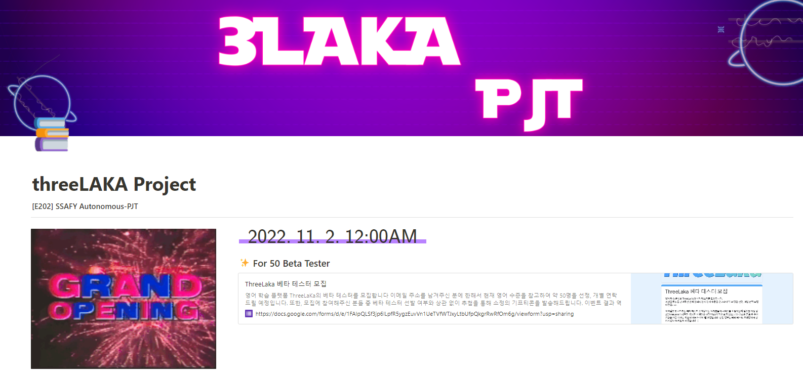


- Figma

- Swagger

  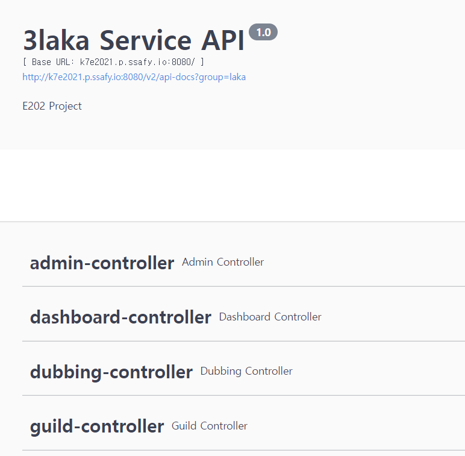

- Webex

- Mattermost

  

## 📋요구사항 정의서

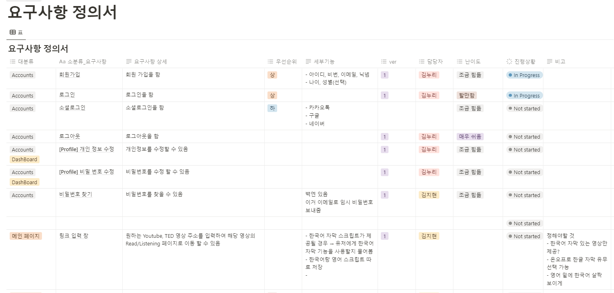


## 💡와이프레임 및 스토리보드

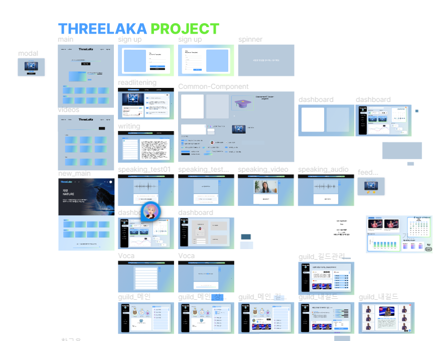


## ⚙컨벤션

### - [Git 컨벤션](https://www.notion.so/Git-Convention-2cb57bc05688496bbedd59c8d2f6f21d)

### - [Jira 컨벤션](https://www.notion.so/Jira-Convention-3f4c52e939c0456e8e59f280fe93133b)


### 🖇ERD

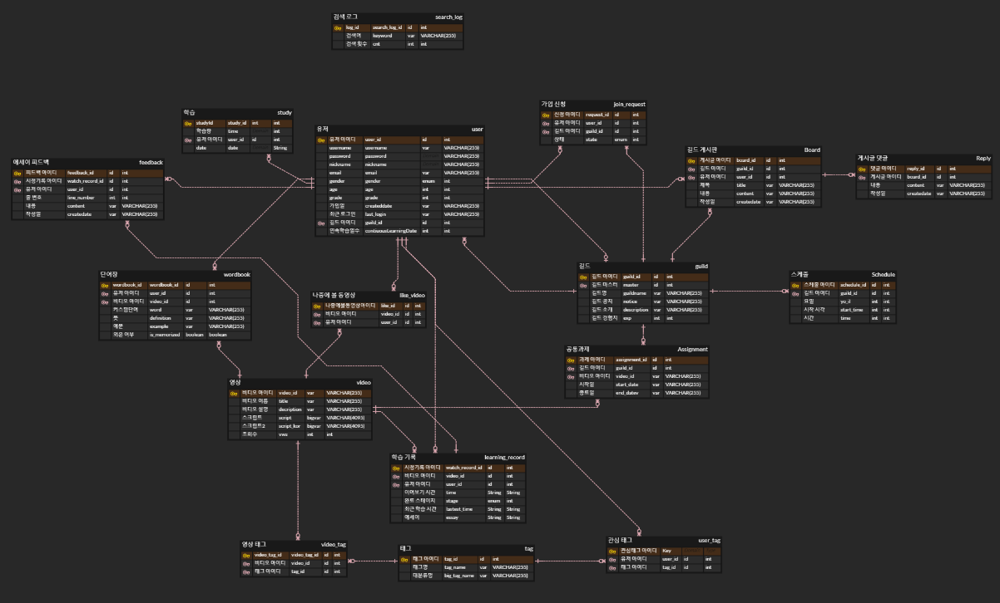


### 🎲  디렉토리 구조

**백엔드 디렉토리 구조**

```.gitignore
│  gitmessage.txt
│
├─.gitlab
│  └─merge_request_templates
│          default.md
│          MR_Template.md
│
├─Backend
│  ├─3laka
│  │  │  .gitignore
│  │  │  build.gradle
│  │  │  dockerfile
│  │  │  gradlew
│  │  │  gradlew.bat
│  │  │  settings.gradle
│  │  │
│  │  ├─.gradle
│  │  │  ├─7.5
│  │  │  │  │  gc.properties
│  │  │  │  │
│  │  │  │  ├─checksums
│  │  │  │  │      checksums.lock
│  │  │  │  │
│  │  │  │  ├─dependencies-accessors
│  │  │  │  │      dependencies-accessors.lock
│  │  │  │  │      gc.properties
│  │  │  │  │
│  │  │  │  ├─executionHistory
│  │  │  │  │      executionHistory.lock
│  │  │  │  │
│  │  │  │  ├─fileChanges
│  │  │  │  │      last-build.bin
│  │  │  │  │
│  │  │  │  ├─fileHashes
│  │  │  │  │      fileHashes.lock
│  │  │  │  │
│  │  │  │  └─vcsMetadata
│  │  │  ├─buildOutputCleanup
│  │  │  │      buildOutputCleanup.lock
│  │  │  │      cache.properties
│  │  │  │
│  │  │  └─vcs-1
│  │  │          gc.properties
│  │  │
│  │  ├─.idea
│  │  │      compiler.xml
│  │  │      gradle.xml
│  │  │      jarRepositories.xml
│  │  │      misc.xml
│  │  │      vcs.xml
│  │  │      workspace.xml
│  │  │
│  │  ├─gradle
│  │  │  └─wrapper
│  │  │          gradle-wrapper.jar
│  │  │          gradle-wrapper.properties
│  │  │
│  │  └─src
│  │      └─main
│  │          ├─java
│  │          │  └─com
│  │          │      └─ssafy
│  │          │          └─laka
│  │          │              │  Application.java
│  │          │              │
│  │          │              ├─config
│  │          │              │      MailConfig.java
│  │          │              │      QueryDslConfig.java
│  │          │              │      SecurityConfig.java
│  │          │              │      SwaggerConfig.java
│  │          │              │      WebConfig.java
│  │          │              │
│  │          │              ├─controller
│  │          │              │      AdminController.java
│  │          │              │      ControllerAdvice.java
│  │          │              │      DashboardController.java
│  │          │              │      DubbingController.java
│  │          │              │      GuildController.java
│  │          │              │      StudyController.java
│  │          │              │      TagController.java
│  │          │              │      UserController.java
│  │          │              │
│  │          │              ├─domain
│  │          │              │  │  Alert.java
│  │          │              │  │  Assignment.java
│  │          │              │  │  Comment.java
│  │          │              │  │  Dubbing.java
│  │          │              │  │  Essay.java
│  │          │              │  │  Guild.java
│  │          │              │  │  JoinRequest.java
│  │          │              │  │  LearningRecord.java
│  │          │              │  │  LikeDub.java
│  │          │              │  │  LikeVideo.java
│  │          │              │  │  Schedule.java
│  │          │              │  │  Script.java
│  │          │              │  │  ScriptKor.java
│  │          │              │  │  SearchLog.java
│  │          │              │  │  Study.java
│  │          │              │  │  Tag.java
│  │          │              │  │  User.java
│  │          │              │  │  UserTag.java
│  │          │              │  │  Video.java
│  │          │              │  │  VideoTag.java
│  │          │              │  │  Wordbook.java
│  │          │              │  │
│  │          │              │  ├─basetime
│  │          │              │  │      BaseTime.java
│  │          │              │  │
│  │          │              │  └─enums
│  │          │              │          AlertState.java
│  │          │              │          FriendStatus.java
│  │          │              │          Gender.java
│  │          │              │          Role.java
│  │          │              │          Stage.java
│  │          │              │          State.java
│  │          │              │
│  │          │              ├─dto
│  │          │              │  ├─alert
│  │          │              │  │      AlertResponseDto.java
│  │          │              │  │
│  │          │              │  ├─dashboard
│  │          │              │  │      CalendarDto.java
│  │          │              │  │      HistoryNumDto.java
│  │          │              │  │      InterestTagReqeustDto.java
│  │          │              │  │      PlayingVideoDto.java
│  │          │              │  │      TimeHistoryDto.java
│  │          │              │  │      TodayWordDto.java
│  │          │              │  │      VideoDto.java
│  │          │              │  │
│  │          │              │  ├─exception
│  │          │              │  │  │  CustomException.java
│  │          │              │  │  │  ErrorCode.java
│  │          │              │  │  │  ErrorResponse.java
│  │          │              │  │  │
│  │          │              │  │  ├─alert
│  │          │              │  │  │      AlertListEmptyException.java
│  │          │              │  │  │      AlertNotFoundException.java
│  │          │              │  │  │
│  │          │              │  │  ├─common
│  │          │              │  │  │      InvalidParameterException.java
│  │          │              │  │  │
│  │          │              │  │  ├─dashboard
│  │          │              │  │  │      LearningRecordNotFoundException.java
│  │          │              │  │  │      StudyNotFoundException.java
│  │          │              │  │  │      TagNotFoundException.java
│  │          │              │  │  │      TooManyTagException.java
│  │          │              │  │  │
│  │          │              │  │  ├─guild
│  │          │              │  │  │      AlreadyInGuildException.java
│  │          │              │  │  │      AssignmentNotFoundException.java
│  │          │              │  │  │      DuplicateGuildNameException.java
│  │          │              │  │  │      DuplicateRequestException.java
│  │          │              │  │  │      GuildExcessException.java
│  │          │              │  │  │      GuildMasterException.java
│  │          │              │  │  │      GuildNotFoundException.java
│  │          │              │  │  │      LeftMemberExistException.java
│  │          │              │  │  │      NotGuildMemberException.java
│  │          │              │  │  │      NotInGuildException.java
│  │          │              │  │  │      NotMasterException.java
│  │          │              │  │  │      NotMyGuildException.java
│  │          │              │  │  │      RequestListEmptyException.java
│  │          │              │  │  │      RequestNotFoundException.java
│  │          │              │  │  │
│  │          │              │  │  ├─study
│  │          │              │  │  │      LearningRecordNotExistException.java
│  │          │              │  │  │      NotCurrentUserException.java
│  │          │              │  │  │      NotInDictionaryException.java
│  │          │              │  │  │      NotInWordbookException.java
│  │          │              │  │  │      NotLikedVideoException.java
│  │          │              │  │  │      NotTedException.java
│  │          │              │  │  │      ScriptNotFoundException.java
│  │          │              │  │  │      TooShortToSearchException.java
│  │          │              │  │  │      VideoNotFoundException.java
│  │          │              │  │  │      WordAlreadyExistException.java
│  │          │              │  │  │
│  │          │              │  │  └─user
│  │          │              │  │          DuplicateEmailException.java
│  │          │              │  │          DuplicateNicknameException.java
│  │          │              │  │          DuplicateUsernameException.java
│  │          │              │  │          UserNotFoundException.java
│  │          │              │  │
│  │          │              │  ├─guild
│  │          │              │  │      AssignmentRequestDto.java
│  │          │              │  │      AssignmentResponseDto.java
│  │          │              │  │      AssignmentUpdateRequestDto.java
│  │          │              │  │      EssayDto.java
│  │          │              │  │      GoodMemberDto.java
│  │          │              │  │      GoodMemberInterface.java
│  │          │              │  │      GuildCreateDto.java
│  │          │              │  │      GuildOrderResponseDto.java
│  │          │              │  │      GuildRankDto.java
│  │          │              │  │      GuildRequestDto.java
│  │          │              │  │      GuildResponseDto.java
│  │          │              │  │      GuildSearchDto.java
│  │          │              │  │      JoinRequestDto.java
│  │          │              │  │      MemberResponseDto.java
│  │          │              │  │      NoticeResponseDto.java
│  │          │              │  │      ProgressInterface.java
│  │          │              │  │
│  │          │              │  ├─jwt
│  │          │              │  │      TokenDto.java
│  │          │              │  │      TokenRequestDto.java
│  │          │              │  │
│  │          │              │  ├─study
│  │          │              │  │      EssayRequestDto.java
│  │          │              │  │      EssayResponseDto.java
│  │          │              │  │      LearningRecordRequestDto.java
│  │          │              │  │      LearningRecordResponseDto.java
│  │          │              │  │      LikeVideoRequestDto.java
│  │          │              │  │      RecentLearningRecordResponseDto.java
│  │          │              │  │      RecommendsListResponseDto.java
│  │          │              │  │      ScriptRequestDto.java
│  │          │              │  │      SurveyRequestDto.java
│  │          │              │  │      UpdateLearningRequestDto.java
│  │          │              │  │      UpdateStageRequestDto.java
│  │          │              │  │      UrlRequestDto.java
│  │          │              │  │      VideoDescriptionResponseDto.java
│  │          │              │  │      VideoRequestDto.java
│  │          │              │  │      VideoResponseDto.java
│  │          │              │  │      WordbookRequestDto.java
│  │          │              │  │      WordbookResponseDto.java
│  │          │              │  │      WordDeleteRequestDto.java
│  │          │              │  │      WordRequestDto.java
│  │          │              │  │      YoutubeDto.java
│  │          │              │  │
│  │          │              │  ├─tag
│  │          │              │  │      TagResponseDto.java
│  │          │              │  │
│  │          │              │  └─user
│  │          │              │          ChangePasswordDto.java
│  │          │              │          FindPasswordDto.java
│  │          │              │          LoginRequestDto.java
│  │          │              │          SignUpRequestDto.java
│  │          │              │          UpdateUserRequestDto.java
│  │          │              │          UserListResponseDto.java
│  │          │              │          UserResponseDto.java
│  │          │              │
│  │          │              ├─jwt
│  │          │              │      JwtAccessDeniedHandler.java
│  │          │              │      JwtAuthenticationEntryPoint.java
│  │          │              │      JwtFilter.java
│  │          │              │      JwtSecurityConfig.java
│  │          │              │      TokenProvider.java
│  │          │              │
│  │          │              ├─repository
│  │          │              │      AlertRepository.java
│  │          │              │      AssignmentRepository.java
│  │          │              │      CommentRepository.java
│  │          │              │      DubbingRepository.java
│  │          │              │      EssayRepository.java
│  │          │              │      GuildRepository.java
│  │          │              │      GuildRepositorySupport.java
│  │          │              │      JoinRequestRepository.java
│  │          │              │      LearningRecordRepository.java
│  │          │              │      LikeDubRepository.java
│  │          │              │      LikeVideoRepository.java
│  │          │              │      ScriptKorRepository.java
│  │          │              │      ScriptRepository.java
│  │          │              │      SearchLogRepository.java
│  │          │              │      StudyRepository.java
│  │          │              │      TagRepository.java
│  │          │              │      UserRepository.java
│  │          │              │      UserTagRepository.java
│  │          │              │      VideoRepository.java
│  │          │              │      WordbookRepository.java
│  │          │              │
│  │          │              ├─service
│  │          │              │      AdminService.java
│  │          │              │      AdminServiceImpl.java
│  │          │              │      AlertService.java
│  │          │              │      AlertServiceImpl.java
│  │          │              │      CustomUserDetailsService.java
│  │          │              │      DashboardService.java
│  │          │              │      DashboardServiceImpl.java
│  │          │              │      DubbingService.java
│  │          │              │      DubbingServiceImpl.java
│  │          │              │      GuildService.java
│  │          │              │      GuildServiceImpl.java
│  │          │              │      MailService.java
│  │          │              │      MailServiceImpl.java
│  │          │              │      StudyService.java
│  │          │              │      StudyServiceImpl.java
│  │          │              │      TagService.java
│  │          │              │      TagServiceImpl.java
│  │          │              │      UserService.java
│  │          │              │      UserServiceImpl.java
│  │          │              │      YoutubeService.java
│  │          │              │      YoutubeServiceImpl.java
│  │          │              │
│  │          │              └─util
│  │          │                      SecurityUtil.java
│  │          │
│  │          └─resources
│  │                  application.properties
│  │
│  └─FastAPI
│          .gitignore
│          dockerfile
│          main.py
│          models.py
│          preprocess.py
│          requirements.txt
│
└─discord
        discordBot.py
        youtubedata.json
```

**프론트엔드 트리구조**

```
frontend
├─ .gitignore
├─ .prettierrc
├─ config
│  ├─ env.js
│  ├─ getHttpsConfig.js
│  ├─ jest
│  │  ├─ babelTransform.js
│  │  ├─ cssTransform.js
│  │  └─ fileTransform.js
│  ├─ modules.js
│  ├─ paths.js
│  ├─ webpack
│  │  └─ persistentCache
│  │     └─ createEnvironmentHash.js
│  ├─ webpack.config.js
│  └─ webpackDevServer.config.js
├─ dockerfile
├─ package-lock.json
├─ package.json
├─ public
│  ├─ favicon.ico
│  ├─ index.html
│  ├─ logo192.png
│  ├─ logo512.png
│  ├─ manifest.json
│  └─ robots.txt
├─ README.md
├─ src
│  ├─ App.css
│  ├─ App.test.tsx
│  ├─ App.tsx
│  ├─ features
│  │  ├─ auth
│  │  │  ├─ authSagas.tsx
│  │  │  └─ authSlice.tsx
│  │  ├─ counter
│  │  │  ├─ counter-slice.ts
│  │  │  └─ counterSagas.ts
│  │  ├─ dashboard
│  │  │  ├─ dashboard-slice.tsx
│  │  │  └─ dashboardSaga.tsx
│  │  ├─ guild
│  │  │  ├─ guild-slice.tsx
│  │  │  └─ guildSaga.tsx
│  │  ├─ Read
│  │  │  ├─ read-slice.ts
│  │  │  └─ readSaga.ts
│  │  ├─ rootReducer.ts
│  │  ├─ rootSaga.ts
│  │  ├─ store.ts
│  │  ├─ study
│  │  │  ├─ study-slice.ts
│  │  │  └─ studySaga.ts
│  │  ├─ video
│  │  │  ├─ video-slice.ts
│  │  │  └─ videoSaga.ts
│  │  └─ writing
│  │     ├─ writing-slice.ts
│  │     └─ writingSaga.ts
│  ├─ fonts
│  │  ├─ fredoka-one-v13-latin-regular.woff
│  │  ├─ NanumSquareRoundR.woff
│  │  ├─ NotoSansKR-Regular.woff
│  │  ├─ Pretendard-Bold.otf
│  │  ├─ Pretendard-ExtraBold.otf
│  │  ├─ Pretendard-Light.otf
│  │  └─ Pretendard-Regular.otf
│  ├─ index.css
│  ├─ index.tsx
│  ├─ layout
│  │  ├─ Header.tsx
│  │  ├─ MainHeader.tsx
│  │  ├─ MainLayout.tsx
│  │  ├─ PageNotFound.tsx
│  │  ├─ SideBar.tsx
│  │  └─ StudyLayout.tsx
│  ├─ media
│  │  └─ images
│  │     └─ 404image.gif
│  ├─ models
│  │  ├─ common.ts
│  │  ├─ dashboard.ts
│  │  ├─ guild.ts
│  │  ├─ index.ts
│  │  ├─ read.ts
│  │  ├─ study.ts
│  │  ├─ user.ts
│  │  ├─ video.ts
│  │  └─ write.ts
│  ├─ pages
│  │  ├─ Dashboard
│  │  │  ├─ CustomSetting
│  │  │  │  └─ CustomSetting.tsx
│  │  │  ├─ DailyBoard
│  │  │  │  ├─ Calendar.tsx
│  │  │  │  ├─ CalendarHeader.tsx
│  │  │  │  ├─ DailyBoard.tsx
│  │  │  │  ├─ DailyStudyGraph.tsx
│  │  │  │  ├─ DashboardVideoCard.tsx
│  │  │  │  ├─ DashboardVideos.tsx
│  │  │  │  ├─ DateIndicator.tsx
│  │  │  │  ├─ GraphContainer.tsx
│  │  │  │  ├─ HistoryCounter.tsx
│  │  │  │  ├─ MonthIndicator.tsx
│  │  │  │  ├─ StudyHistoryContainer.tsx
│  │  │  │  ├─ VideoContainer.tsx
│  │  │  │  └─ WeekdayIndicator.tsx
│  │  │  ├─ DashBoardPage.tsx
│  │  │  ├─ HistoryBoard
│  │  │  │  └─ HistoryBoard.tsx
│  │  │  ├─ Profile
│  │  │  │  ├─ ModifyPassword.tsx
│  │  │  │  ├─ ModifyUserInfo.tsx
│  │  │  │  ├─ Profile.tsx
│  │  │  │  ├─ ProfileInputField.tsx
│  │  │  │  ├─ ProfileRadioField.tsx
│  │  │  │  ├─ SelectProfile.tsx
│  │  │  │  ├─ UpdateProfile.tsx
│  │  │  │  ├─ UpdateTagModal.tsx
│  │  │  │  └─ UpdateUserInfo.tsx
│  │  │  └─ Statistics
│  │  │     └─ Statistics.tsx
│  │  ├─ Guild
│  │  │  ├─ components
│  │  │  │  ├─ AddGuildVideoModal.tsx
│  │  │  │  └─ datePicker.css
│  │  │  ├─ EOZ
│  │  │  │  ├─ components
│  │  │  │  │  ├─ EnglishOnlyZone.tsx
│  │  │  │  │  ├─ EozModal.tsx
│  │  │  │  │  ├─ EozRoom.tsx
│  │  │  │  │  ├─ EozRoomInfo.tsx
│  │  │  │  │  ├─ MembersList.tsx
│  │  │  │  │  ├─ StreamVideo.tsx
│  │  │  │  │  ├─ TodayVideo.tsx
│  │  │  │  │  └─ UserEssayBtn.tsx
│  │  │  │  ├─ EnglishOnlyZone.tsx
│  │  │  │  ├─ EozPage.tsx
│  │  │  │  └─ ZonePage.tsx
│  │  │  ├─ GuildMainPage.tsx
│  │  │  ├─ GuildPage.tsx
│  │  │  ├─ MasterSettingPage.tsx
│  │  │  └─ MyGuildPage.tsx
│  │  ├─ Main
│  │  │  ├─ components
│  │  │  │  ├─ GuildNoticeModal.tsx
│  │  │  │  ├─ Modal.tsx
│  │  │  │  ├─ RecentVideo.tsx
│  │  │  │  ├─ RecommendVideoList.tsx
│  │  │  │  ├─ SearchBar.tsx
│  │  │  │  ├─ TagSelectModal.tsx
│  │  │  │  ├─ VideoCard.tsx
│  │  │  │  └─ VideoDataModal.tsx
│  │  │  └─ MainPage.tsx
│  │  ├─ private
│  │  │  ├─ ProtectedLoginRoute.tsx
│  │  │  └─ ProtectedRoute.tsx
│  │  ├─ Study
│  │  │  ├─ Read
│  │  │  │  ├─ components
│  │  │  │  │  ├─ CircularNavComp.tsx
│  │  │  │  │  ├─ DictionaryComp.tsx
│  │  │  │  │  ├─ ScriptComp.tsx
│  │  │  │  │  └─ VideoComp.tsx
│  │  │  │  └─ ReadPage.tsx
│  │  │  ├─ Speaking
│  │  │  │  ├─ components
│  │  │  │  │  ├─ EssayScript.tsx
│  │  │  │  │  ├─ ModeBtnContainer.tsx
│  │  │  │  │  ├─ ModeScreen.tsx
│  │  │  │  │  ├─ ScoreIndicator.tsx
│  │  │  │  │  ├─ SpeakingScreen.tsx
│  │  │  │  │  ├─ SpeechTest.tsx
│  │  │  │  │  ├─ VoiceRecorder.tsx
│  │  │  │  │  ├─ VoiceRecorderForTest.tsx
│  │  │  │  │  └─ WebCam.tsx
│  │  │  │  ├─ SpeakingPage.tsx
│  │  │  │  └─ UseOnScreen.tsx
│  │  │  ├─ Survey.tsx
│  │  │  ├─ Voca
│  │  │  │  └─ VocaPage.tsx
│  │  │  └─ Writing
│  │  │     ├─ components
│  │  │     │  ├─ HighlightTextAreaComp.tsx
│  │  │     │  ├─ TypoCorrectionComp.tsx
│  │  │     │  ├─ WordBookComp.tsx
│  │  │     │  ├─ WordListAndWritingContainer.tsx
│  │  │     │  └─ WritingCircularNavComp.tsx
│  │  │     └─ WritingPage.tsx
│  │  ├─ User
│  │  │  ├─ Auth
│  │  │  │  └─ AuthPage.tsx
│  │  │  ├─ InputField.tsx
│  │  │  ├─ Login
│  │  │  │  └─ LoginForm.tsx
│  │  │  ├─ RadioField.tsx
│  │  │  └─ Signup
│  │  │     └─ SignupForm.tsx
│  │  └─ Videos
│  │     └─ VideosPage.tsx
│  ├─ react-app-env.d.ts
│  ├─ services
│  │  ├─ customAxios.ts
│  │  ├─ dashboardApi.ts
│  │  ├─ guildApi.ts
│  │  ├─ readApi.ts
│  │  ├─ studyApi.ts
│  │  ├─ userApi.ts
│  │  ├─ videoApi.ts
│  │  └─ writeApi.ts
│  ├─ setupTests.ts
│  ├─ styles
│  │  ├─ Common
│  │  │  ├─ CommonBtnStyle.tsx
│  │  │  ├─ CommonDivStyle.tsx
│  │  │  ├─ EtcStyle.tsx
│  │  │  ├─ LoadingSpinner.tsx
│  │  │  └─ VideoModalStyle.tsx
│  │  ├─ DashBoard
│  │  │  └─ DashBoardStyle.ts
│  │  ├─ Guild
│  │  │  ├─ GuildEozStyle.ts
│  │  │  ├─ GuildMainStyle.ts
│  │  │  ├─ MasterSetting.ts
│  │  │  └─ MyGuildStyle.ts
│  │  ├─ Layout
│  │  │  ├─ HeaderStyle.ts
│  │  │  ├─ MainHeaderStyle.ts
│  │  │  └─ SideBarStyle.ts
│  │  ├─ Main
│  │  │  ├─ MainSearchStyle.ts
│  │  │  ├─ MainStyle.ts
│  │  │  ├─ RecentVideoStyle.ts
│  │  │  ├─ TagModalStyle.ts
│  │  │  └─ VideoModalStyle.ts
│  │  ├─ Read
│  │  │  └─ ReadStyle.ts
│  │  ├─ Speaking
│  │  │  └─ SpeakingStyle.ts
│  │  ├─ User
│  │  │  └─ UserStyle.ts
│  │  └─ Writing
│  │     └─ WritingStyle.ts
│  └─ utils
│     ├─ date.tsx
│     ├─ GradientInput.tsx
│     ├─ hooks.ts
│     ├─ moment.tsx
│     ├─ ToastMessage.tsx
│     ├─ ToolTip.tsx
│     ├─ useModal.tsx
│     ├─ useSideScroll.ts
│     └─ VideoModal.tsx
├─ tsconfig.json
└─ yarn.lock
```


